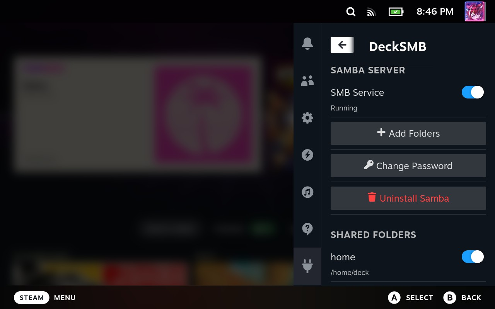

<h1 align="center">
  
  <br>
  DeckSMB
  </br>
</h1>

A [Decky Loader](https://decky.xyz/) plugin to set up  a Samba/SMB server on Steam Deck for file sharing — all from Game Mode.

[中文](README_cn.md)

## Features


- **One-click Samba setup** — automated install/uninstall
- **Start / Stop** — SMB service with a toggle switch
- **Manage shared folders** — add, remove, and enable/disable shares

## Quick Start

1. Download ZIP from [Release](https://github.com/chillibeaver/DeckSMB/releases)
2. In Decky Loader, go to **Settings** → **General** → enable **Developer Mode**
3. Go to the **Developer** tab → **Install Plugin from ZIP**
4. Open the plugin and click **Install Samba**
5. Access your Steam Deck from another device:
   - Should appear immediately in File Explorer under Network
   - If not, try: `smb://steamdeck.local`

**Default credentials:**
- Username: `deck`
- Password: `0000`

> **Note:** SteamOS updates will remove Samba due to its immutable filesystem. You will need to reinstall after each system update. Your shares and password will be preserved.

### After changing the Samba password

By design, Samba won't disconnect you immediately after changing your password. To see the change take effect, toggle the SMB service once, and the new credentials will be required.

Windows caches SMB credentials. If you change your Samba password, Windows will still try the old one and fail with "access denied". To fix this, open CMD or Powershell and run:
```cmd
net use \\steamdeck /delete
```
Then reconnect and enter the new password.

## Feedback

Feel free to open an issue if you encounter any problems.

## License

MIT
