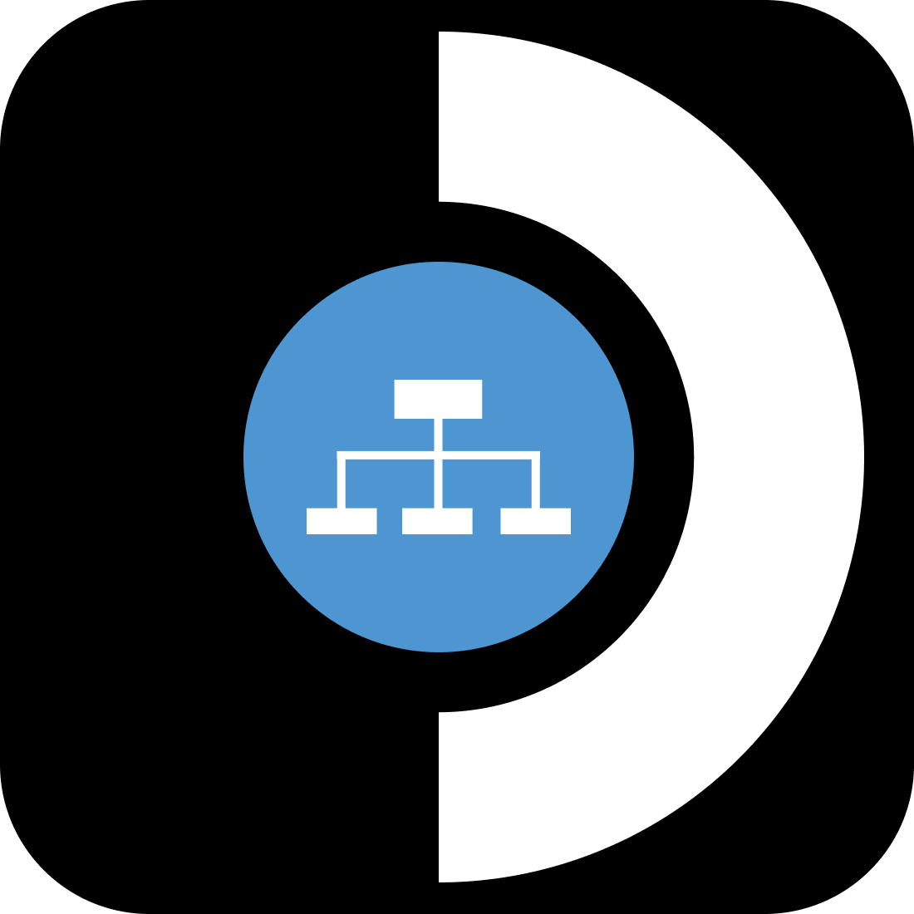
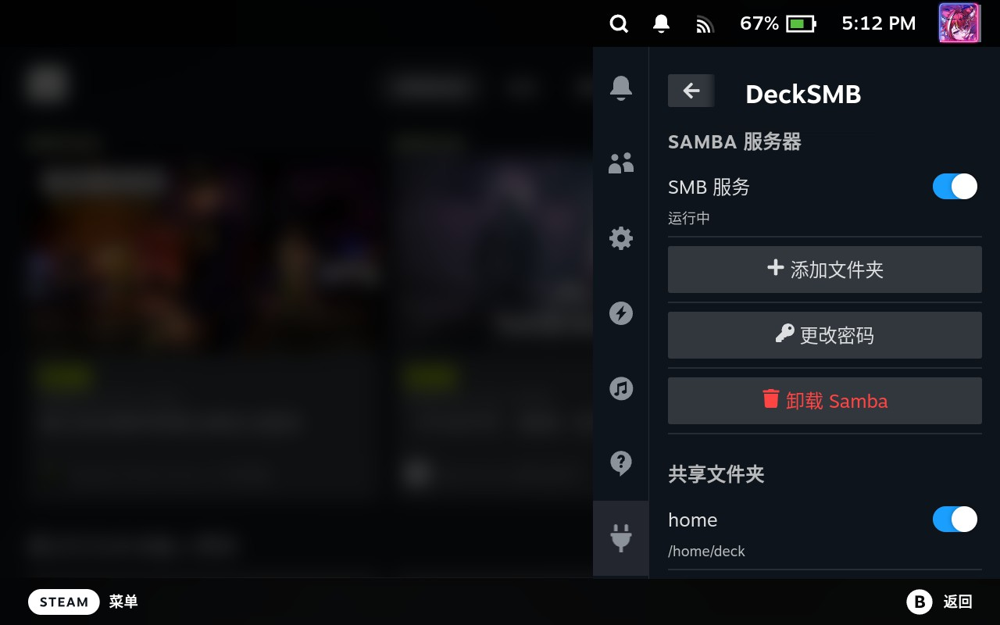

<h1 align="center">
  
  <br>
  DeckSMB
  </br>
</h1>

一个 [Decky Loader](https://decky.xyz/) 插件，用于在 Steam Deck 上搭建 Samba/SMB 服务器以实现文件共享——全程在游戏模式下完成。

## 功能



- **一键安装 Samba** — 自动化安装/卸载
- **启动 / 停止** — 通过开关切换 SMB 服务
- **管理共享文件夹** — 添加、移除和启用/禁用共享

## 安装

1. 从 [Release](https://github.com/chillibeaver/DeckSMB/releases) 下载 ZIP 文件
2. 在 Decky Loader 中，进入 **设置** → **通用** → 启用 **开发者模式**
3. 进入 **开发者** 选项卡 → **从 ZIP 安装插件**
4. 打开插件并点击 **安装 Samba**
5. 从其他设备访问你的 Steam Deck：
   - 应该会立即出现在文件资源管理器的"网络"中
   - 如果没有，请尝试：`smb://steamdeck.local`

**默认凭据：**
- 用户名：`deck`
- 密码：`0000`

> **注意：** 由于 SteamOS 采用不可变文件系统，系统更新会移除 Samba。每次系统更新后需要重新安装。你的共享配置和密码将会保留。

### 更改 Samba 密码后

按照设计，更改密码后 Samba 不会立即断开你的连接。要使更改生效，请切换一次 SMB 服务开关，之后将要求使用新凭据。

Windows 会缓存 SMB 凭据。如果你更改了 Samba 密码，Windows 仍会尝试使用旧密码，导致"访问被拒绝"。要解决此问题，请打开 CMD 或 Powershell 并运行：

```cmd
net use \\steamdeck /delete
```

然后重新连接并输入新密码。

## 反馈

如果遇到任何问题，欢迎提交 issue。

## 许可证

MIT
